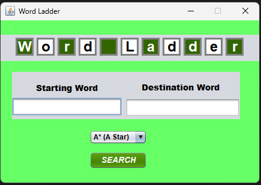
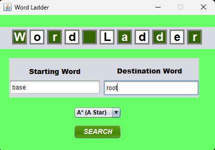
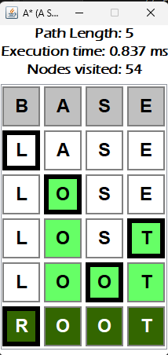

<h1 align="center">Word Ladder Game Solver</h1>
<h2 id="description">Description </h2>

Word Ladder is a word puzzle where you try to transform one word into another by changing one letter at a time, creating a sequence of valid English words. Each intermediate word in the sequence must also be a valid English word. The challenge is to do this in the fewest number of steps possible. For example, to transform "cat" into "dog," you might go: cat -> cot -> cog -> dog. It's a fun exercise in wordplay and problem-solving.  
  
In this project, I'm making a Word Ladder Solver, that solves word ladder game with route planning algorithm, such as A* Algorithm, GBFS (Greedy Best First Search) Algorithm, UCS (Uniform Cost Search) Algorithm. It aims to give and display the optimal solution for the starting and destination word given. It also has the GUI display of the solution steps, complete with box's color difference between steps to display the move more clearly. 

<h2 id="table-of-contents">Table of Contents</h2>
- <a href="#description">Description</a><br/>
- <a href="#table-of-contents">Table of Contents</a><br/>
- <a href="#tech-stack">Tech Stack</a><br/>
- <a href="#how-to-run">How To Run</a><br/>
- <a href="#usage">Usage</a><br/>
- <a href="#author">Author</a><br/>
- <a href="#note">Additional Note</a>

<h2 id="tech-stack">Tech Stack</h2>

- Java
- Java AWT
- Java Swing

<h2 id="how-to-run">How To Run</h2>

- Clone this repository
```
git clone https://github.com/chankiel/Tucil3_13522029
```

- Go to the directory where you cloned this repository
```
cd path/to/this/repo
```

- Run the batch file
```
./run.bat
```

<h2 id="usage">Usage</h2>

1. Input your starting word into the "Starting Word" labeled input textbox. Do the same with your destination word  

2. Pick the algorithm of your choice to solve the game. It concists of A* Algorithm, GBFS Algorithm, or UCS Algorithm.   


3. Click "SEARCH" to show the results  


<h2 id="author">Author</h2>
<pre>
  Name  : Ignatius Jhon Hezkiel Chan
  NIM   : 13522029
  Email : <a href="mailto:13522029@std.stei.itb.ac.id">13522029@std.stei.itb.ac.id</a>
</pre>